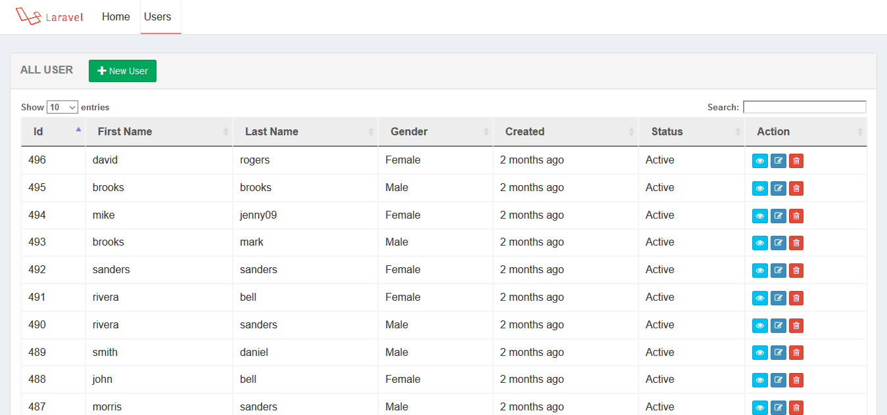
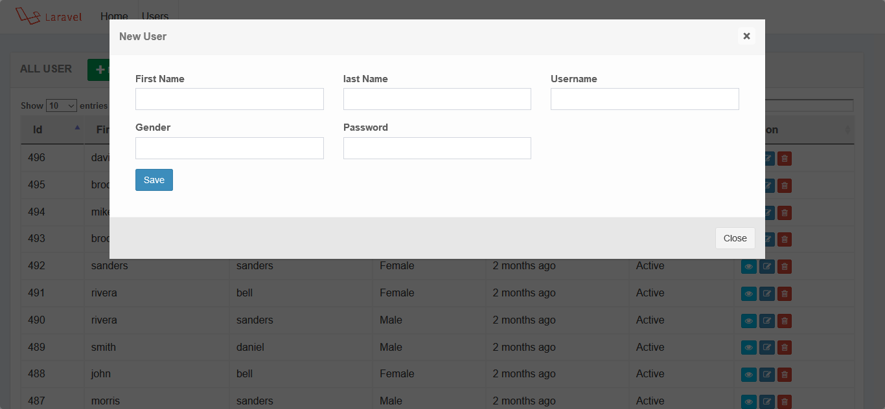
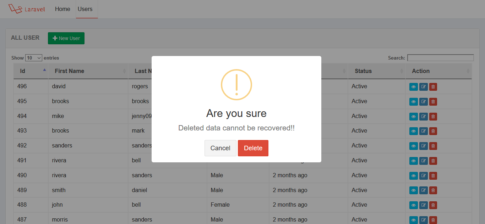

# Laravel Ajax CRUD and Yazra Datatable

### Requirements

    1. PHP version upto 7.1.3    
    2. Laravel version  5.6, 5.7    

### Installation

    1. Clone the project using git clone   
    2. Go to project root folder.Open git bash or terminal and run  composer install   
    3. Copy a fresh .env file from laravel github    
    4. Update .env file by adding database information    
    5. Run php artisan key:generate in the terminal    
    6. Run php artisan migrate 
    

     
Output : 

 Find me on  Linkedin  : [My Linkedin profile  link](https://www.linkedin.com/in/monjur-morshed-riyadh-6aaba465/)  \
